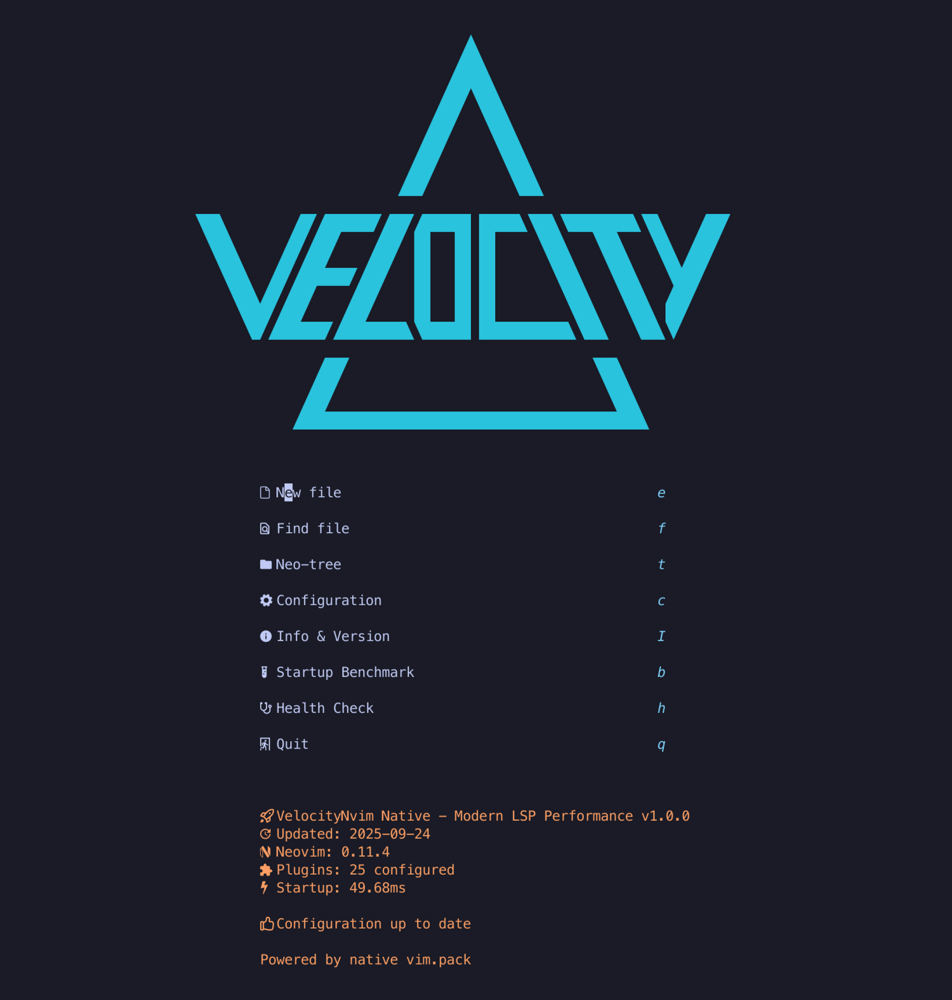

# VelocityNvim

> Native vim.pack Neovim Distribution - No Plugin Manager Required

[](https://opensource.org/licenses/MIT)
[](https://neovim.io)
[](#architecture)

A modern Neovim distribution built on native vim.pack architecture with modern vim.lsp.config API.

**Website**: https://velocitynvim.com




## Features

- **Native vim.pack** - No external plugin manager, pure Git operations
- **Eager Loading** - All plugins load at startup, no mid-workflow interruptions
- **Modern LSP** - vim.lsp.config API with global configuration pattern
- **Rust-Powered** - Optimized tools (fzf, ripgrep, fd, blink.cmp)
- **Optional Packages** - Choose LaTeX, Typst, or Strudel support during installation

## Requirements

- **Neovim >= 0.11.0**
- **Git**
- **NerdFont** (recommended: [MesloLGS NF](https://github.com/ryanoasis/nerd-fonts/releases/latest))

### Optional Performance Tools

```bash
# Arch Linux
sudo pacman -S fzf ripgrep fd git-delta ruff

# macOS
brew install fzf ripgrep fd git-delta ruff
```

## Installation

### Standard Installation

```bash
# Backup existing config
[ -d ~/.config/nvim ] && mv ~/.config/nvim ~/.config/nvim.backup

# Clone VelocityNvim
git clone https://github.com/Maik-0000FF/VelocityNvim.git ~/.config/nvim

# Install plugins
nvim -c "PluginSync" -c "qall"

# Launch
nvim
```

### Parallel Installation (keep existing config)

```bash
# Clone to separate directory
git clone https://github.com/Maik-0000FF/VelocityNvim.git ~/.config/VelocityNvim

# Install plugins
NVIM_APPNAME=VelocityNvim nvim -c "PluginSync" -c "qall"

# Launch
NVIM_APPNAME=VelocityNvim nvim

# Optional: Add alias to ~/.bashrc or ~/.zshrc
alias velocity="NVIM_APPNAME=VelocityNvim nvim"
```

## Optional Packages

During first installation, you can choose to include:

| Package | Description | Dependencies |
|---------|-------------|--------------|
| **Strudel** | Live Coding Music | npm, chromium/brave |
| **LaTeX** | Scientific Writing | texlab, latexmk |
| **Typst** | Modern Typesetting | tinymist, typst |

### Install Optional Packages Later

```vim
:OptionalPackagesToggle strudel
:OptionalPackagesToggle latex
:OptionalPackagesToggle typst
:PluginSync
" Restart Neovim
```

### Check Status

```vim
:OptionalPackages
```

## Essential Commands

| Command | Description |
|---------|-------------|
| `:PluginSync` | Install/update all plugins |
| `:PluginStatus` | Show plugin installation status |
| `:VelocityHealth` | System health check |
| `:VelocityInfo` | Show version information |
| `:LspStatus` | LSP server status |
| `:NotifyHistory` | View notification history |

## Key Mappings

| Key | Description |
|-----|-------------|
| `<Space>` | Leader key |
| `<leader>e` | Toggle file explorer |
| `<leader>ff` | Find files |
| `<leader>fg` | Live grep |
| `<leader>nh` | Notification history |
| `<leader>ne` | Error messages |

## Adding Plugins

```lua
-- 1. Add to lua/plugins/manage.lua
M.plugins["plugin-name"] = "https://github.com/author/plugin.git"

-- 2. Create config lua/plugins/category/plugin-name.lua
local ok, plugin = pcall(require, "plugin-name")
if not ok then return end
plugin.setup({})

-- 3. Load in lua/plugins/init.lua
safe_require("plugins.category.plugin-name")

-- 4. Install
:PluginSync
```

## Uninstallation

### Standard Installation

```bash
rm -rf ~/.config/nvim
rm -rf ~/.local/share/nvim
rm -rf ~/.local/state/nvim
rm -rf ~/.cache/nvim
```

### Parallel Installation

```bash
rm -rf ~/.config/VelocityNvim
rm -rf ~/.local/share/VelocityNvim
rm -rf ~/.local/state/VelocityNvim
rm -rf ~/.cache/VelocityNvim
```

## Contributing

1. Fork the repository
2. Make changes
3. Test with `:VelocityHealth`
4. Submit a pull request

## Support

- [GitHub Issues](https://github.com/Maik-0000FF/VelocityNvim/issues)
- Star this repository

### Bitcoin Donations

```
bc1q6gmpgfn4wx2hx2c3njgpep9tl00etma9k7w6d4
```

## License

[MIT License](LICENSE)

## Trademark

**VelocityNvim** is a registered trademark. See [TRADEMARK.md](TRADEMARK.md) for usage guidelines.
